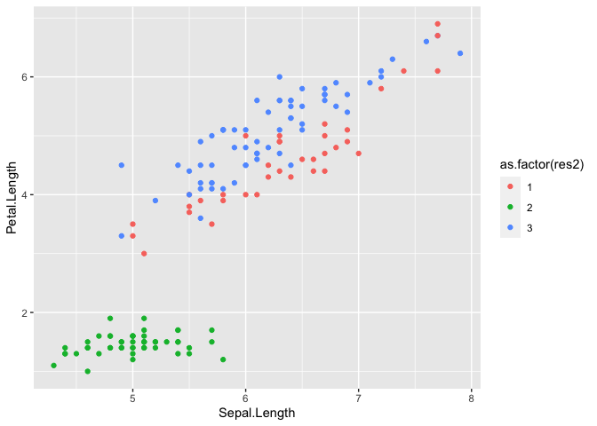

<!-- README.md is generated from README.Rmd. Please edit that file -->

# clust431

<!-- badges: start -->
<!-- badges: end -->

The goal of clust431 is to use different clustering methods that can be
used on datasets to cluster observations.

## Installation

You can install the released version of clust431 from
[CRAN](https://CRAN.R-project.org) with:

``` r
install.packages("clust431")
```

``` r
library(clust431)
library(tidyverse)
```

``` r
iris2 <- iris %>%
    select(-Species)
```

### em_clust

``` r
set.seed(175)
res <- em_clust(iris2, 3)

res$cluster
#>   [1] 2 2 2 2 2 2 2 2 2 2 2 2 2 2 2 2 2 2 2 2 2 2 2 2 2 2 2 2 2 2 2 2 2 2 2 2 2
#>  [38] 2 2 2 2 2 2 2 2 2 2 2 2 2 1 3 1 1 1 3 3 3 1 3 1 3 1 3 3 1 3 3 1 1 3 1 1 3
#>  [75] 1 1 1 1 3 1 1 1 1 3 3 3 1 1 3 3 3 3 1 1 3 3 3 1 1 3 3 3 3 3 3 3 3 3 3 3 3
#> [112] 3 3 3 3 3 3 3 1 1 3 3 1 1 3 3 3 3 3 1 1 3 3 3 3 1 3 3 3 3 3 1 3 3 3 1 1 3
#> [149] 3 3

head(res$probabilities)
#>                           [,1]       [,2]       [,3]
#> X0.190492177369962  0.19049218 0.23503159 0.18384325
#> X0.174397137335806  0.17439714 0.20849061 0.16240026
#> X0.23758985159672   0.23758985 0.29497553 0.23019225
#> X0.217141790978416  0.21714179 0.26438985 0.21435547
#> X0.157675174104769  0.15767517 0.19676590 0.15514826
#> X0.0639978101301481 0.06399781 0.07655077 0.06334376

res$cluster_means
#>   Sepal.Length Sepal.Width Petal.Length Petal.Width
#> 1     5.708704    2.987880     3.582689   1.1075839
#> 2     5.594427    3.036163     3.284311   0.9852406
#> 3     5.718232    2.986516     3.629822   1.1294253

res$covariances
#>               Sepal.Length Sepal.Width Petal.Length Petal.Width cluster
#> Sepal.Length    0.70394013 -0.03302075    1.2980757   0.5287057       1
#> Sepal.Width    -0.03302075  0.19483562   -0.3173987  -0.1152243       1
#> Petal.Length    1.29807574 -0.31739867    3.1472179   1.3118020       1
#> Petal.Width     0.52870572 -0.11522426    1.3118020   0.5894807       1
#> Sepal.Length1   0.74806379 -0.03712927    1.3930110   0.5699174       2
#> Sepal.Width1   -0.03712927  0.19043060   -0.3195611  -0.1170766       2
#> Petal.Length1   1.39301098 -0.31956106    3.3421648   1.3977033       2
#> Petal.Width1    0.56991741 -0.11707660    1.3977033   0.6271496       2
#> Sepal.Length2   0.70144882 -0.03351519    1.2904583   0.5250750       3
#> Sepal.Width2   -0.03351519  0.19502821   -0.3205182  -0.1166554       3
#> Petal.Length2   1.29045831 -0.32051816    3.1328178   1.3046302       3
#> Petal.Width2    0.52507496 -0.11665542    1.3046302   0.5859262       3

res$iterations
#> [1] 7
```

The output of the **em_clust()** function is a vector of cluster
assignments for each of the observations in the dataframe.

**How accurate were the cluster assignments?**

``` r
res2 <- res$cluster
iris2 <- iris2 %>% 
    cbind(res2)
```

``` r
ggplot(iris2, aes(x = Sepal.Length, 
                  y = Petal.Length,
                  color = as.factor(res2))) + 
    geom_point()
```



Looking only at Sepal Length and Petal Length in the iris dataset, we
can see that the cluster assignments from the **em_clust()** function
make sense. The observations assigned to cluster 3 have similar Sepal
and Petal lengths, and the observations in cluster 1 are all very
similar in terms of these two variables.
